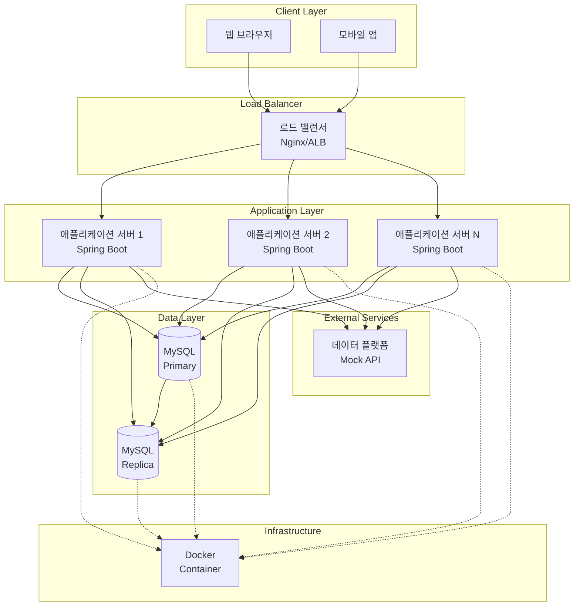

# 인프라 구성도

## 시스템 아키텍처



## 구성 요소 설명

### 1. Client Layer (클라이언트 계층)
- **웹 브라우저**: 웹 기반 사용자 인터페이스
- **모바일 앱**: 모바일 기반 사용자 인터페이스

### 2. Load Balancer (로드 밸런서)
- **역할**: 
  - 다수의 애플리케이션 서버로 트래픽 분산
  - 고가용성 보장 (서버 장애 시 자동 전환)
- **구현**: Nginx 또는 AWS ALB (Application Load Balancer)
- **특징**:
  - Round-Robin 또는 Least Connection 방식으로 부하 분산
  - Health Check를 통한 서버 상태 모니터링

### 3. Application Layer (애플리케이션 계층)
- **구성**: 
  - 다수의 Spring Boot 애플리케이션 서버 (수평 확장 가능)
  - 각 서버는 독립적으로 동작하며 상태를 공유하지 않음 (Stateless)
- **기술 스택**:
  - Spring Boot 3.4.1
  - Java 17
  - Spring Data JPA
- **특징**:
  - **Stateless 설계**: 세션 정보를 서버에 저장하지 않음
  - **동시성 처리**: 
    - 데이터베이스 레벨 락을 통한 재고 및 포인트 관리
    - 트랜잭션 격리 수준 설정으로 데이터 일관성 보장
  - **분산 환경 고려**:
    - 데이터베이스 락을 통한 동시성 제어
    - 외부 시스템(데이터 플랫폼)과의 비동기 통신

### 4. Data Layer (데이터 계층)
- **Primary Database (MySQL)**:
  - 역할: 모든 쓰기 작업 처리
  - 특징: 
    - 트랜잭션 처리
    - 동시성 제어 (비관적 락/낙관적 락)
    - 데이터 일관성 보장
- **Replica Database (MySQL)**:
  - 역할: 읽기 작업 처리 (읽기 부하 분산)
  - 특징:
    - Primary DB로부터 비동기 복제
    - 조회 성능 향상
    - Primary DB 부하 감소

### 5. External Services (외부 서비스)
- **데이터 플랫폼**:
  - 역할: 주문 성공 시 주문 정보 수집
  - 통신 방식: 
    - 비동기 HTTP 통신 (REST API)
    - 실패 시 재시도 메커니즘 (Retry)
    - Circuit Breaker 패턴 적용 고려
  - 구현: 
    - 개발/테스트 환경: Mock API 또는 Fake Module
    - 운영 환경: 실제 데이터 플랫폼 API

### 6. Infrastructure (인프라)
- **Docker**:
  - 역할: 컨테이너화된 서비스 관리
  - 구성:
    - 애플리케이션 서버 컨테이너
    - MySQL 컨테이너
  - 특징:
    - `docker-compose.yml`을 통한 로컬 개발 환경 구성
    - 프로덕션 환경에서는 Kubernetes 또는 ECS 고려

## 데이터 흐름

### 1. 상품 조회 흐름
```
클라이언트 → 로드 밸런서 → 애플리케이션 서버 → Replica DB → 응답
```

### 2. 주문/결제 흐름
```
클라이언트 → 로드 밸런서 → 애플리케이션 서버 → Primary DB (트랜잭션)
  ↓
재고 확인 → 포인트 확인 → 재고 차감 → 포인트 차감 → 주문 생성
  ↓
데이터 플랫폼 전송 (비동기) → 응답
```

### 3. 포인트 충전 흐름
```
클라이언트 → 로드 밸런서 → 애플리케이션 서버 → Primary DB (트랜잭션)
  ↓
포인트 잔액 증가 → 포인트 이력 생성 → 응답
```

## 확장성 고려사항

### 1. 수평 확장
- **애플리케이션 서버**: 로드 밸런서를 통해 무제한 확장 가능
- **데이터베이스**: 
  - 읽기: Replica 추가로 확장
  - 쓰기: 샤딩(Sharding) 고려 (사용자 ID 기반)

### 2. 성능 최적화
- **캐싱**: 
  - 상품 정보: Redis 캐시 고려 (조회 빈도 높음)
  - 포인트 잔액: 캐싱 시 주의 (일관성 문제)
- **비동기 처리**:
  - 데이터 플랫폼 전송: 메시지 큐(RabbitMQ, Kafka) 고려
  - 주문 알림: 이벤트 기반 아키텍처 고려

### 3. 고가용성
- **애플리케이션 서버**: 다중 인스턴스 운영
- **데이터베이스**: 
  - Primary-Replica 구조로 장애 대응
  - 자동 Failover 메커니즘

## 보안 고려사항

1. **네트워크 보안**: 
   - 로드 밸런서와 애플리케이션 서버 간 내부 네트워크
   - 데이터베이스는 애플리케이션 서버에서만 접근 가능
2. **인증/인가**: 
   - API Gateway에서 인증 처리 (향후 구현)
   - 사용자 식별자 검증
3. **데이터 보안**: 
   - 데이터베이스 연결 암호화
   - 민감 정보 암호화 저장

## 모니터링 및 로깅

1. **애플리케이션 모니터링**:
   - Spring Boot Actuator를 통한 헬스 체크
   - 메트릭 수집 (Prometheus + Grafana)
2. **로깅**:
   - 중앙화된 로그 수집 (ELK Stack 고려)
   - 구조화된 로그 형식 (JSON)
3. **알림**:
   - 에러 발생 시 알림 시스템 연동
   - 성능 저하 감지 및 알림
